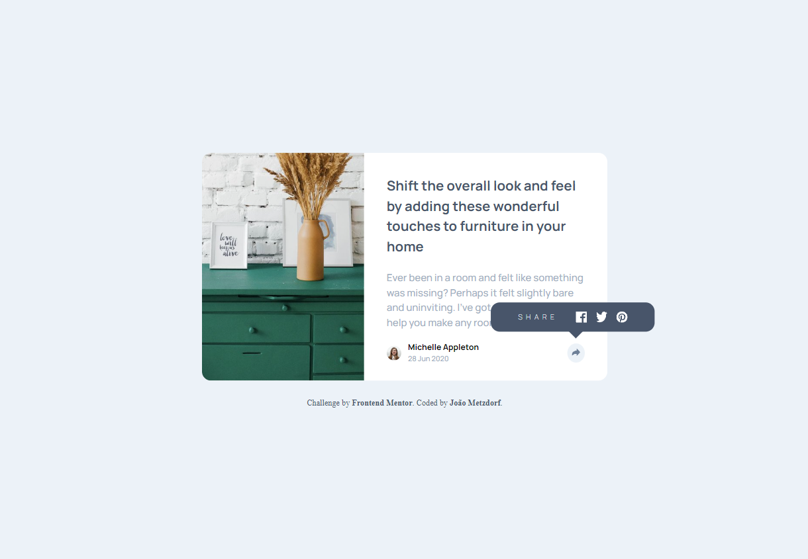

# Frontend Mentor - Article preview component solution

Este é um projeto de solução de componente de visualização de artigo que foi desenvolvido a partir de um desafio do Frontend Mentor.

## Visão Geral

### Desafio

Construir a visualização do artigo o mais próximo possível do design fornecido.

### Screenshot

### Links

- [Site]()  

## Meu processo

### Construído com

- HTML5
- CSS3
- Flexbox
- JavaScript
- Mobile-first

### O que aprendi

- Aprendi mais sobre estilização
- Aprendi mais sobre alternância com click do botão
- Aprendi mais sobre HTML semântico

## Autor

- Frontend Mentor - [@joaometzdorf](https://www.frontendmentor.io/profile/joaometzdorf)
- GitHub - [@joaometzdorf](https://www.github.com/joaometzdorf)
